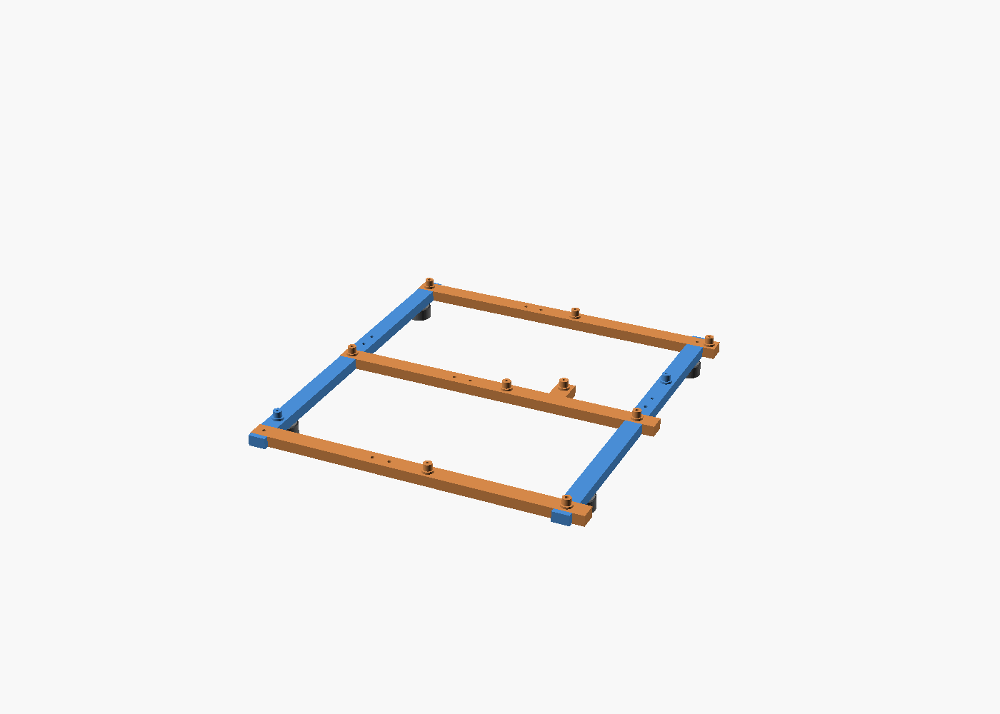
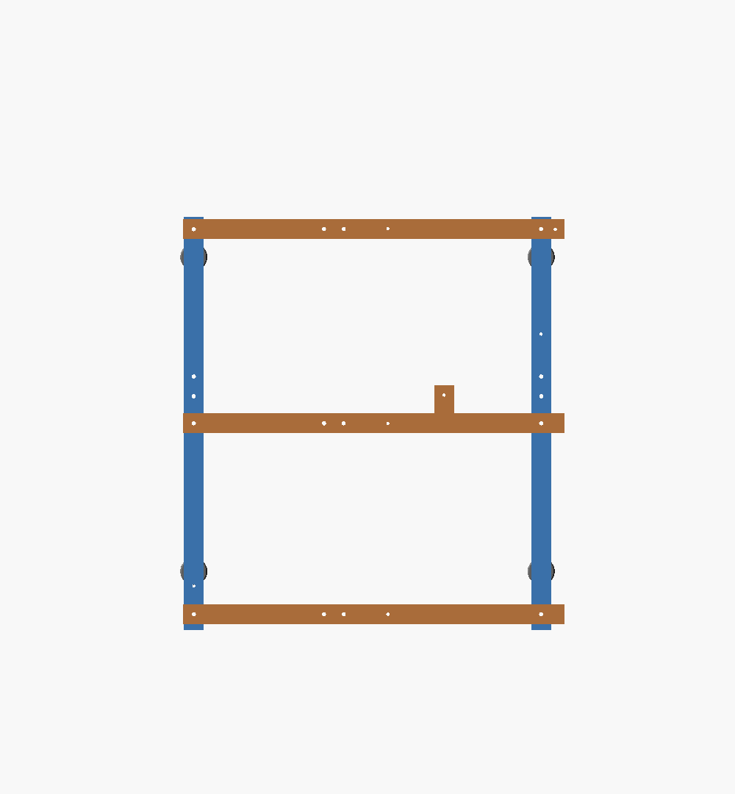
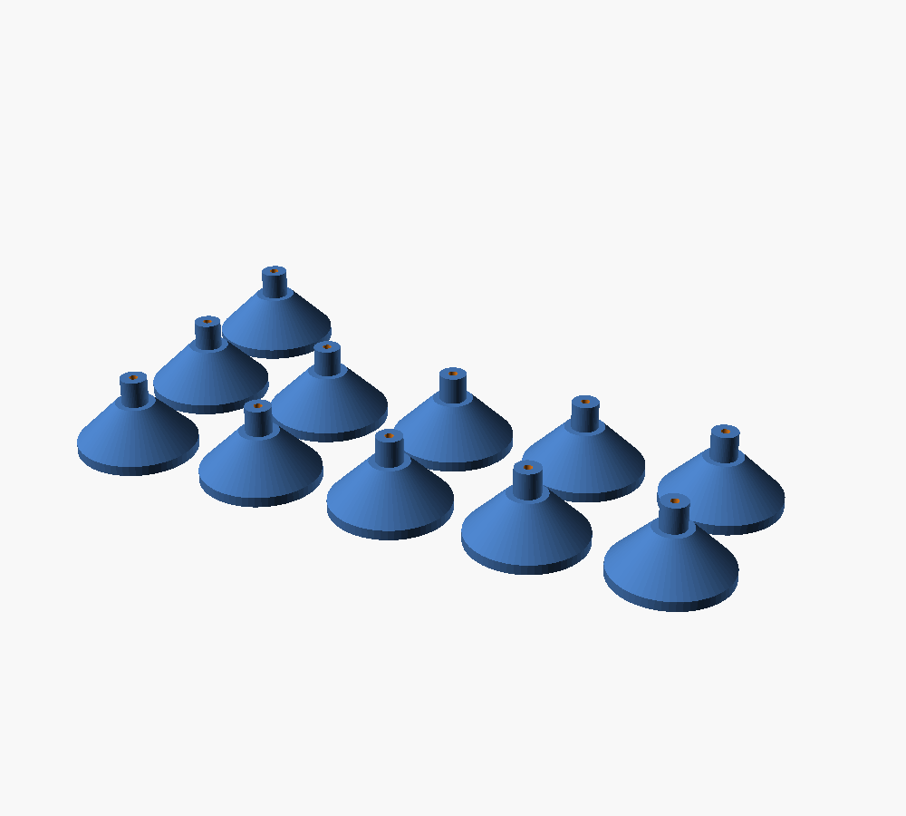

# SSI-EEB Split Open Frame

An open ladder frame for **SSI-EEB (304.8 x 330.2 mm)** motherboards, split into
segments that print on a **220 x 220 mm** bed (Ender 3 class) and bolt together.

SSI-EEB is the largest standard motherboard footprint and its mounting hole pattern
is a superset of E-ATX and ATX, so E-ATX and ATX boards mount on this same frame
using the subset of standoffs that line up.

Generated by `sbccb_eeb_frame.scad`. Hole data comes from
`SBC_Model_Framework/sbc_models.cfg`, entry `ssi-eeb`.



## Why a frame and not a tray

A solid tray for this footprint is 304.8 x 330.2 mm and cannot be printed on a
220 mm bed in one piece, in any orientation. This design keeps only the material
that actually carries a standoff:

- **2 longitudinal rails** at x = 6.35 and x = 288.29, running the full board length
- **3 cross rails** at y = 10.16, 165.10 and 322.70, running the full board width
- every rail is **split in two** and rejoined with a bolted half lap
- rail crossings are also half laps, so the frame assembles into one flat plane

All 11 SSI-EEB standoffs are carried, each one fully backed by rail material.
The standoff at (209.55, 187.96) sits on a short outrigger off the middle cross rail.



## Parts

Measured from the exported STLs. "Z 18" means the part carries a standoff, "Z 10"
is a plain rail segment.

| part | qty | X | Y | Z | volume | standoffs |
| --- | --- | --- | --- | --- | --- | --- |
| `long_left_rear` | 1 | 16.00 | 212.50 | 18 | 29.0 cm3 | left_rear |
| `long_left_front` | 1 | 16.00 | 152.70 | 10 | 20.5 cm3 | - |
| `long_right_rear` | 1 | 16.00 | 212.50 | 10 | 28.6 cm3 | - |
| `long_right_front` | 1 | 16.00 | 152.70 | 18 | 20.9 cm3 | right_middle2 |
| `cross_rear_left` | 1 | 137.50 | 16.00 | 10 | 18.1 cm3 | - |
| `cross_rear_right` | 1 | 202.30 | 16.00 | 18 | 29.4 cm3 | middle_rear, right_rear |
| `cross_middle_left` | 1 | 137.50 | 16.00 | 18 | 18.5 cm3 | left_middle |
| `cross_middle_right` | 1 | 202.30 | 38.86 | 18 | 33.4 cm3 | middle_middle, right_middle, middle2_middle |
| `cross_front_left` | 1 | 137.50 | 16.00 | 18 | 18.5 cm3 | left_front |
| `cross_front_right` | 1 | 202.30 | 16.00 | 18 | 29.3 cm3 | middle_front, right_front |
| `foot` | 4 | 22.00 | 22.00 | 12 | 4.4 cm3 | - |

14 parts, 264 cm3 solid, roughly 150 g of PLA at normal print densities.
The 11 standoffs are spread across 7 of the parts and add up to the full SSI-EEB set.

**The longest part is 212.5 mm.** That leaves only 7.5 mm of margin on a nominal
220 mm bed. If your Ender 3 loses usable area to bed clips or a skirt, drop
`long_splice_y` from 195 to 185 and the rear segments become 202.5 mm.

## Printing

Every part prints **flat on the bed with the standoffs pointing up and no support
material**. Feet are separate parts so that nothing protrudes below the rails.

Open `sbccb_eeb_frame.scad` in OpenSCAD, then either:

- set `view = "platter"` to see the whole set laid out, or
- set `view = "part"` and pick a part from the `part` dropdown, then export STL.

Exported STLs for the default parameters are already in `stl/eeb_frame/`, ready to
slice. Regenerate them after changing any parameter:

```sh
# the Windows installer does not put openscad on PATH
OSC="/c/Program Files/OpenSCAD/openscad.com"

for p in long_left_rear long_left_front long_right_rear long_right_front \
         cross_rear_left cross_rear_right cross_middle_left cross_middle_right \
         cross_front_left cross_front_right foot; do
  "$OSC" -o "stl/eeb_frame/$p.stl" -D 'view="part"' -D "part=\"$p\"" sbccb_eeb_frame.scad
done
```

Each part takes about a minute to render. Running four at a time is roughly four
times faster on a quad core.

The full platter is about 357 mm wide, so print it in two or three batches.


### Suggested print settings

| setting | value |
| --- | --- |
| material | PLA or PETG |
| layer height | 0.2 mm |
| perimeters | 4 |
| infill | 25 % or more |
| supports | none |

The rails are loaded in bending, so perimeters matter more than infill here.

## Hardware

All M3. Counts are for the default parameters.

| item | qty | where |
| --- | --- | --- |
| M3 x 12 bolt | 12 | 2 rail crossings, 4 longitudinal splice, 6 cross splice |
| M3 x 25 bolt | 4 | board screws that also clamp a rail crossing |
| M3 x 12 bolt | 7 | board screws into plain standoffs |
| M3 x 16 countersunk bolt | 4 | feet |
| M3 hex nut | 16 | 12 joint bolts + 4 shared board screws |

Hex pockets on the underside of the lower member hold the nuts while you tighten
from above. With `standoff_fastener = "tap"` the 7 plain standoffs take a 2.6 mm
hole and the M3 cuts its own thread; set it to `"insert"` for heat set inserts or
`"nut"` for clearance holes with nuts throughout.

## Assembly

1. Bolt each longitudinal rail's two segments together at the half lap
   (2 bolts each, nuts into the pockets underneath). Do not fully tighten yet.
2. Bolt each cross rail's two segments together the same way.
3. Drop the three cross rails onto the two longitudinal rails. Every crossing is a
   half lap, so the assembly sits flat with a single 10 mm rail plane.
4. Fasten the 2 crossings that have a dedicated bolt: left/rear and right/front.
5. Fasten the 4 crossings that share a board screw hole
   (right_rear, left_middle, right_middle, left_front) with the M3 x 25 bolts,
   nuts underneath.
6. Check the frame is flat on a known flat surface, then tighten everything.
7. Bolt on the 4 feet from underneath.
8. Lower the board on and drive the 11 board screws. Start the 4 shared ones first,
   they set the frame square.

## Parameters worth changing

| parameter | default | note |
| --- | --- | --- |
| `build` | `"frame"` | set to `"pillars"` for free standing standoff towers instead of a frame |
| `rail_w` / `rail_h` | 16 / 10 | rail cross section, raise `rail_h` for a stiffer frame |
| `standoff_height` | 8 | clearance under the board, 6.35 is the ATX nominal |
| `standoff_fastener` | `"tap"` | `tap`, `nut` or `insert` |
| `long_splice_y` | 195 | move the longitudinal splice, keep it clear of standoffs and crossings |
| `cross_splice_x` | 120 | same for the cross rails |
| `lap_length` | 30 | overlap of the splice joints |
| `foot_height` | 12 | ground clearance |

If your board's holes do not match, edit the `eeb_holes` table at the top of the
file, then re-check that no standoff lands inside a splice lap.

## The "pillars" build

`build = "pillars"` drops the frame entirely and generates 11 free standing
standoff towers. Each is a 36 mm base, a cone, and an 8 mm standoff on top,
23 mm tall overall. The board itself acts as the structure.



All 11 towers lay out inside **206 x 122 mm, so the whole set prints in one batch**
on a 220 x 220 bed. 101 cm3 of solid, roughly 56 g of PLA.

`stl/eeb_pillars/pillar_tower.stl` is one tower; print 11 of them, or set
`view = "platter"` with `build = "pillars"` to export the arranged set in one file.

Hardware is just 11 M3 screws. With `standoff_fastener = "tap"` the 2.6 mm hole
takes an M3 x 12 directly; there is nothing else to bolt together.

Trade offs against the frame:

- **much faster and cheaper** — one print batch, no joint hardware, no assembly
- **not rigid** — the towers are independent, so the board carries all the load and
  the stack can slide. Stick the bases down with double sided tape or adhesive
  rubber feet before loading the board.
- no defined ground plane between standoffs, so it is a bring-up or test bench
  arrangement rather than a case

## Limits

- The frame is an open bench. There is no enclosure, no I/O shield bracket, no PSU
  or drive mounting yet.
- E-ATX is a loose designation. Boards sold as E-ATX vary in both size and hole
  pattern; this frame provides the SSI-EEB superset, and an individual board will
  use whichever subset it has.
- A fully printed frame is more flexible than steel. Keep the board supported at
  every hole it has, and support the frame near the PCIe slots if you hang heavy
  cards off it.
