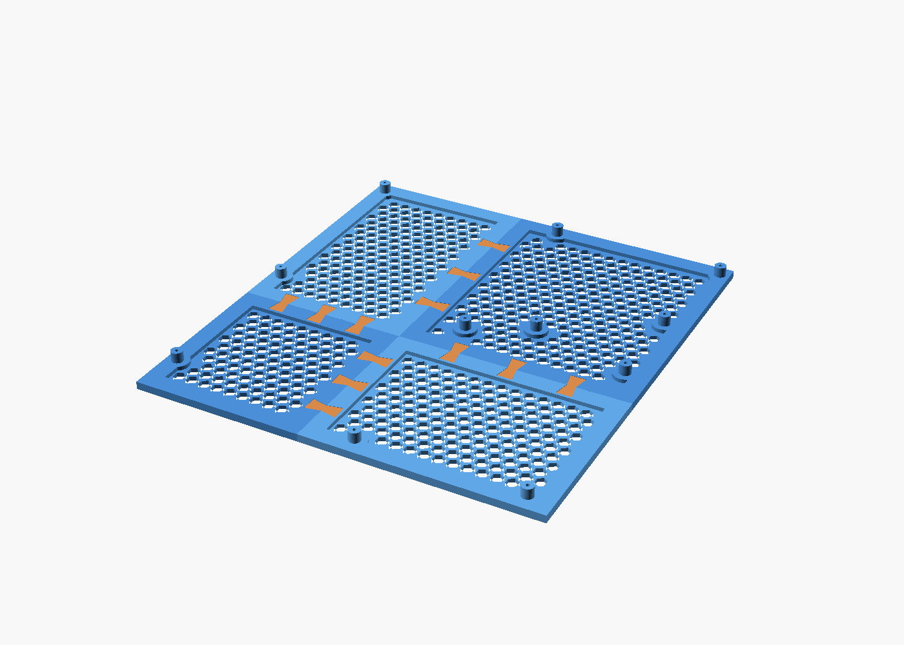
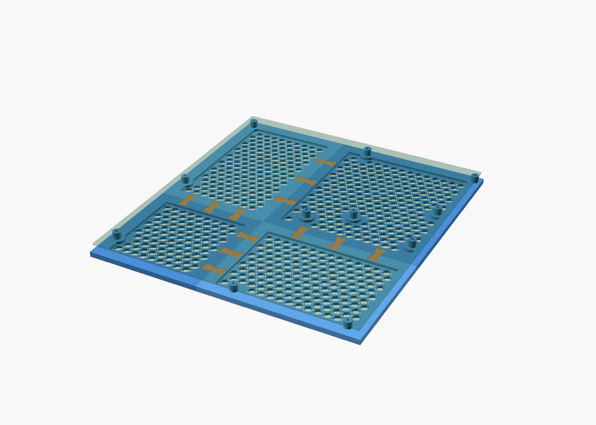
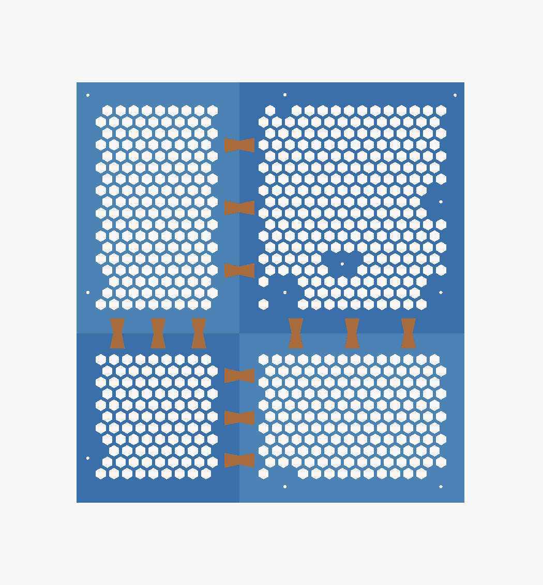

# Vented Split Base Panel

A hex vented base panel for **SSI-EEB (and so E-ATX / ATX)** motherboards with the
11 standoffs built in, split into tiles that fit a **220 x 220 mm** bed and locked
together with **printed butterfly keys**.

The board screws straight into the standoffs with 11 M3 screws. Nothing else needs
fastening. This replaces the free standing pillars of
[`sbccb_eeb_frame`](./sbccb_eeb_frame.md), which had no rigidity between them.

Generated by `sbccb_eeb_panel.scad`. Hole data comes from
`SBC_Model_Framework/sbc_models.cfg`, entry `ssi-eeb`.





## Layout

The panel is 309.8 x 335.2 mm, the board plus 2.5 mm all round. It splits into a
2 x 2 grid at `split_x = 130` and `split_y = 135`.

The seams are deliberately **not** at the centre. With equal splits, three standoffs
(`left_middle`, `middle_middle`, `right_middle`, all at board y = 165.1) land
exactly on the horizontal seam, and three more sit 11.4 mm from the vertical seam
where the keys go. The default splits keep every standoff at least 32 mm from a
seam and every standoff pad at least 11.8 mm clear of a key pocket.



## Why butterfly keys

A sliding joint such as a dovetail cannot assemble a 2 x 2 grid, because the last
tile would have to slide in two directions at once. Butterfly keys drop in
**vertically**, so tile order does not matter. Each seam is a butt joint with a
bowtie key straddling it; the key locks the seam in tension and aligns the tiles.


## Structure

- **field** 3 mm thick, hex cells 8 mm across the flats with 2.5 mm walls
- **rib** 14 mm wide and 6 mm thick around every tile, doubled up along seams
- **standoffs** 9 mm diameter, 8 mm above a solid 18 mm pad cut out of the hex
  field, 2.6 mm hole straight through so an M3 cuts its own thread

Only whole hex cells are generated, and cells are dropped around each pad, so
nothing is left as a thin sliver. Everything prints flat side down, standoffs up,
no support.

## Measured parts

| part | qty | X | Y | Z | volume | standoffs |
| --- | --- | --- | --- | --- | --- | --- |
| `tile_0_0` | 1 | 130.00 | 135.00 | 14 | 54.1 cm3 | 1 |
| `tile_1_0` | 1 | 179.80 | 135.00 | 14 | 70.5 cm3 | 2 |
| `tile_0_1` | 1 | 130.00 | 200.20 | 14 | 75.0 cm3 | 2 |
| `tile_1_1` | 1 | 179.80 | 200.20 | 14 | 102.0 cm3 | 6 |
| `seam_key` | 12 | 23.80 | 11.75 | 3.80 | 0.8 cm3 | - |

Tile 0 sits at the rear left of the board (board origin), row 1 is the front.
Every tile is under the 212 mm usable length; the largest is 179.8 x 200.2.

No two tiles fit on one bed together, so plan on four print batches, with the
twelve keys alongside any of them.

## Material and hardware

| | |
| --- | --- |
| solid volume | 311 cm3 |
| PLA, printed near solid | roughly 390 g |
| screws | 11 x M3, about 12 to 16 mm long |
| optional | 4 stick on rubber feet, so air can reach the vents from below |

A hex field this thin prints as almost pure perimeter, so treat it as close to
100 % dense rather than applying an infill fraction. For a lighter panel set
`panel_t = 2`, `cell_size = 10`, `cell_wall = 2`.

**Put feet under it.** Laid flat on a desk the bottom vents are blocked.

## Printing

```sh
OSC="/c/Program Files/OpenSCAD/openscad.com"

for c in 0 1; do for r in 0 1; do
  "$OSC" -o "stl/eeb_panel/tile_${c}_${r}.stl" \
    -D 'view="part"' -D 'part="tile"' -D "tile_col=$c" -D "tile_row=$r" \
    sbccb_eeb_panel.scad
done; done

"$OSC" -o "stl/eeb_panel/seam_key.stl" -D 'view="part"' -D 'part="key"' \
  sbccb_eeb_panel.scad
```

Ready made STLs for the defaults are in `stl/eeb_panel/`.

Suggested settings: 0.2 mm layers, 4 perimeters, PLA or PETG.

### Test the key fit first

`key_fit` is the clearance per face between key and pocket, 0.1 mm by default.
This has not been test printed. Before printing four tiles, print one key and one
tile corner:

- key falls in loosely, lower `key_fit` toward 0
- key will not seat, raise `key_fit` to 0.15 or 0.2

## Parameters

| parameter | default | note |
| --- | --- | --- |
| `mount` | `"ssi-eeb"` | `"none"` for a plain vented panel |
| `split_x` / `split_y` | 130 / 135 | seam positions, 0 splits equally to fit the bed |
| `board_offset_x` / `_y` | 2.5 / 2.5 | board corner from the panel corner |
| `standoff_height` | 8 | clearance under the board |
| `standoff_hole` | 2.6 | M3 self tapping, use 3.4 for a through bolt and nut |
| `pad_r` | 9 | solid area kept around each standoff |
| `panel_x` / `panel_y` | 309.8 / 335.2 | overall panel size |
| `panel_t` | 3 | vented field thickness |
| `rib_w` / `rib_t` | 14 / 6 | perimeter rib, `rib_w` must exceed `key_len`/2 |
| `cell_size` / `cell_wall` | 8 / 2.5 | hex size and wall |
| `key_fit` | 0.1 | key clearance per face |
| `keys_per_seam` | 3 | keys per tile edge |

If you move the seams, keep them clear of the standoffs; OpenSCAD echoes a warning
when a tile exceeds the usable bed but does **not** check seam clearance.

## Not done yet

- side panels
