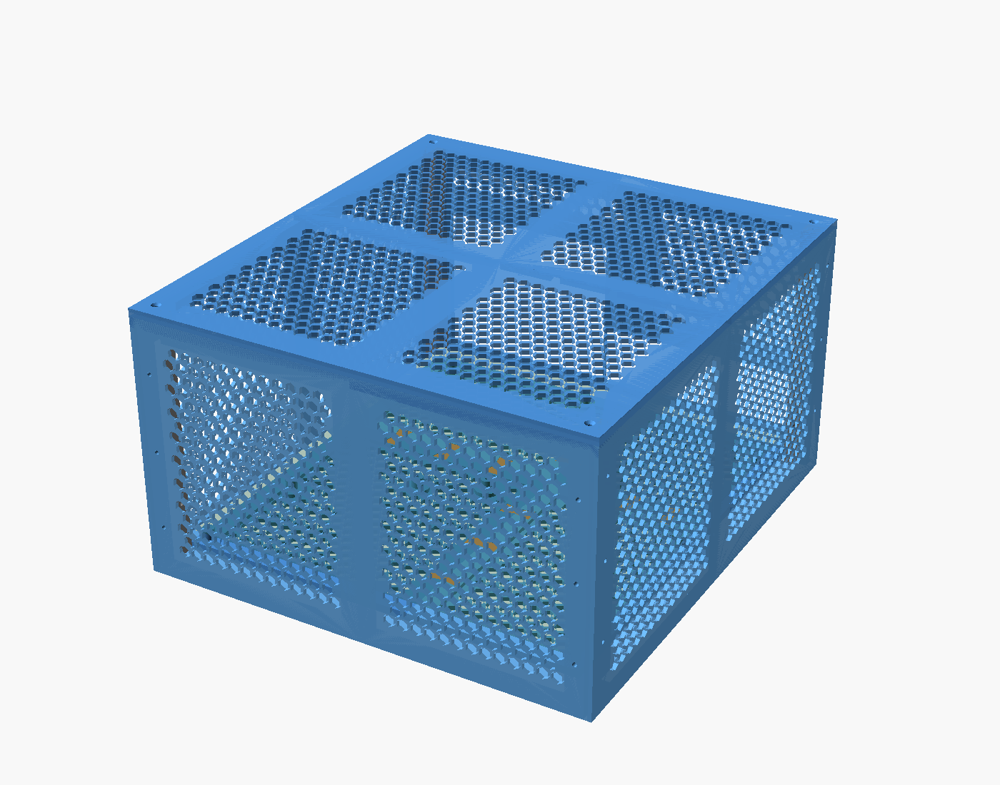
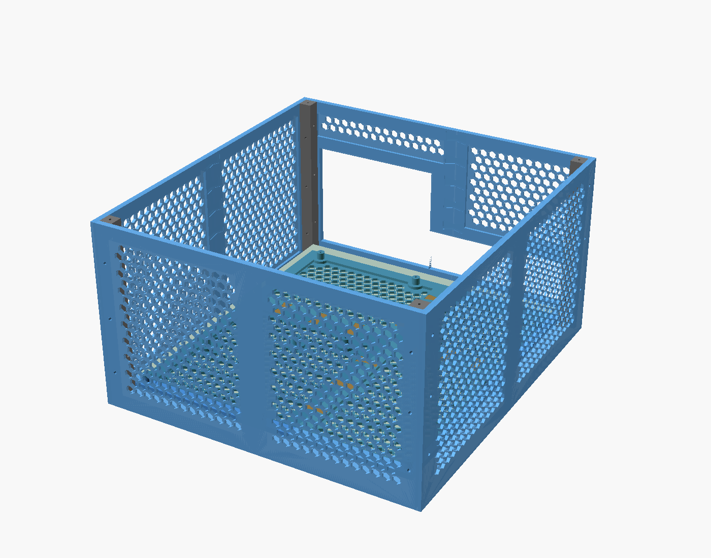
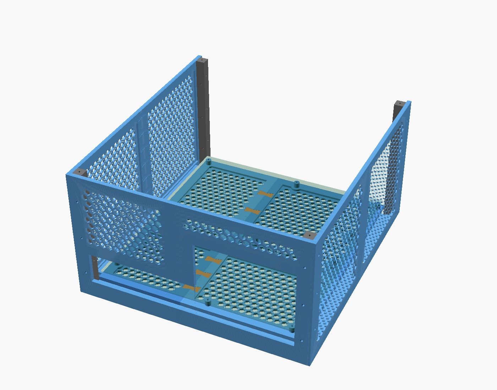
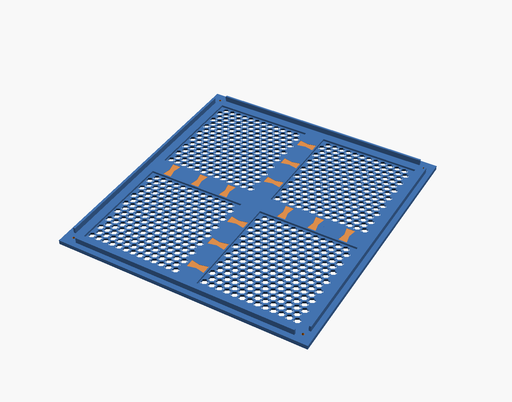
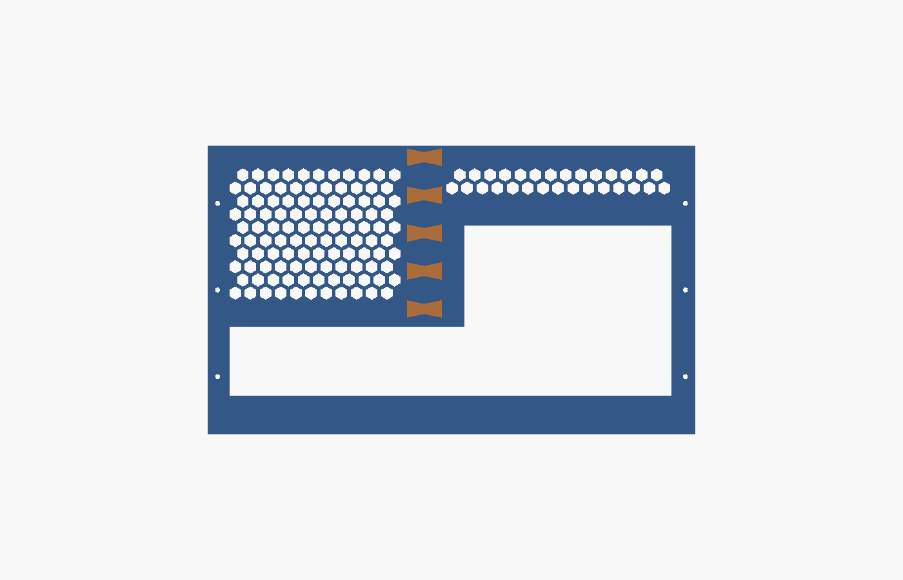

# Vented Side Panels and Top Cover

Hex vented walls that turn [`sbccb_eeb_panel`](./sbccb_eeb_panel.md) into an
closed, fully vented case for SSI-EEB / E-ATX / ATX motherboards, printable on a **220 x 220 mm**
bed.

Generated by `sbccb_eeb_sides.scad`. Base panel dimensions, board offset, lip screw
positions and key shape are read from `sbccb_eeb_panel.scad` through `use <>`, so
the two files cannot drift apart.

## How it goes together

- **Four corner posts** (14 mm square, full height) stand just outside the base
  panel corners. They cannot go inside: the base is only 2.5 mm larger than the
  board, so an inside post would hit the board.
- **Walls lie against the outside of the posts** and are screwed into them with M3.
  Rear and front walls screw into the posts' y faces, left and right walls into the
  x faces, at different heights, so the holes never cross inside a post and **one
  post design fits all four corners**.
- **Every wall has a lip** along the inside of its bottom edge, 10 mm above the desk.
  The lip spans the 14 mm gap between wall and base and reaches 14 mm under the
  base panel's outer rib. **The base panel rests on the lips** and is screwed up into
  them from below, 2 screws per side, into pilot holes already in the base.
- Resting on the lips lifts the base 14 mm off the desk, so the bottom vents work
  without separate feet.
- Walls longer than the bed are split once and rejoined with the same butterfly
  keys as the base panel. Keys on the rear wall avoid the openings.

## Size

| | |
| --- | --- |
| outside | 349.8 x 375.2 x 200 mm |
| board top above the desk | 29.6 mm |
| clearance above the board | 170.4 mm, enough for most tower coolers |
| air gap under the base | 10 mm |

## Top cover

The top cover spans the whole case outline, 349.8 x 375.2, and is split into a 2 x 2
grid of 174.9 x 187.6 tiles joined with 12 keys. Shown above in print orientation,
underside up.

- a **22 mm perimeter rib** lies on the walls and the corner posts
- a **locating rim**, 3 mm thick and 8 mm deep, drops just inside the walls between
  the posts with 1 mm clearance, so the cover cannot slide even with the screws out
- **4 countersunk M3 screws** go down into the top of each corner post, into a 12 mm
  pilot hole
- `show_top = false` hides it in the model view

## Rear openings

The rear wall, shown here in print orientation (outer face down), has two windows
that run into each other:

| window | board x | width | from board top | height |
| --- | --- | --- | --- | --- |
| I/O shield | -1 | 162.5 | -3 | 48 |
| expansion slots | 161.5 | 143 | -3 | 118 |

The I/O aperture on ATX is 158.75 x 44.45 and a full height card bracket is about
120 mm, so both windows are sized slightly generous. **These positions follow
the layout used by `mod/case_adapter.scad` and the ATX nominal sizes. They have not
been measured against a real board.** Check your board's rear I/O and slot
positions before printing the rear wall, and adjust `io_*` / `slot_*`.

Cards are **not retained** by the case; there is no bracket screw rail yet.

## Parts

Measured from the exported STLs, all rendered without warnings.

| part | qty | X | Y | Z | volume |
| --- | --- | --- | --- | --- | --- |
| `rear_0` | 1 | 150.00 | 200.00 | 34 | 100.1 cm3 |
| `rear_1` | 1 | 187.80 | 200.00 | 34 | 115.1 cm3 |
| `front_0` | 1 | 168.90 | 200.00 | 34 | 107.4 cm3 |
| `front_1` | 1 | 168.90 | 200.00 | 34 | 107.4 cm3 |
| `left_0` / `left_1` | 1 each | 187.60 | 200.00 | 34 | 122.2 cm3 each |
| `right_0` / `right_1` | 1 each | 187.60 | 200.00 | 34 | 122.2 cm3 each |
| `post` | 4 | 14.00 | 14.00 | 200.00 | 38.7 cm3 each |
| `top_0_0` .. `top_1_1` | 4 | 174.90 | 187.60 | 14 | 105.3 cm3 each |
| `key` | 38 | 23.80 | 11.75 | 3.80 | 0.8 cm3 each |

Every part fits a 220 x 220 bed. Wall tiles are 34 mm tall as printed: 6 mm of wall
plus the 28 mm lip standing up. Posts print lying down, 200 mm long. Keys per seam:
rear 5 (the openings take the rest of the seam), front, left and right 7 each,
top cover 12. Top cover tiles print outer face down, 14 mm tall with the rim.

Ready made STLs for the defaults are in `stl/eeb_sides/`.

## Material

| | solid volume | PLA, near solid |
| --- | --- | --- |
| 8 wall tiles | 919 cm3 | ~1.14 kg |
| 4 top cover tiles | 421 cm3 | ~0.52 kg |
| 4 posts | 155 cm3 | ~0.19 kg |
| 38 keys | 30 cm3 | ~0.04 kg |
| **sides and top** | **~1525 cm3** | **~1.89 kg** |
| base panel with its 12 keys | 311 cm3 | ~0.39 kg |
| **whole case** | **~1836 cm3** | **~2.28 kg** |

That is more than two 1 kg spools and a lot of print time. To cut it down:

- `wall_field_t = 2`, `top_field_t = 2` and `cell_size = 12`, `cell_wall = 2` for
  lighter vent fields
- lower `case_height` if your cooler is short

## Hardware

| item | qty | where |
| --- | --- | --- |
| M3 x 16 | 24 | walls to posts, 3 per wall end |
| M3 x 8 | 8 | lips up into the base rib. the pilot is 4.5 mm deep in a 6 mm rib, longer screws break through the top |
| M3 x 16 countersunk | 4 | top cover into the corner posts |
| M3 x 12 | 11 | board to standoffs, from the base panel |

## Parameters

| parameter | default | note |
| --- | --- | --- |
| `case_height` | 200 | wall height from the desk, max 212 for a 220 bed |
| `foot_height` | 10 | air gap under the base |
| `wall_t` / `wall_field_t` | 6 / 3 | wall thickness at ribs and in the vent field |
| `wall_rib_w` | 14 | rib width along edges, seams and around openings |
| `lip_t` | 4 | lip thickness |
| `post_s` | 14 | corner post size |
| `io_*`, `slot_*` | see above | rear openings in board coordinates |
| `cutaway` | false | model view without the front wall |
| `show_top` | true | show the top cover in the model |
| `top_split_x` / `_y` | 0 / 0 | top cover seams, 0 splits in half |
| `top_rib_w` | 22 | perimeter rib, must cover wall plus post |
| `top_rim_h` / `_t` / `_gap` | 8 / 3 / 1 | locating rim, 0 height removes it |

## Not done yet

- expansion card bracket retention
- front panel power switch
